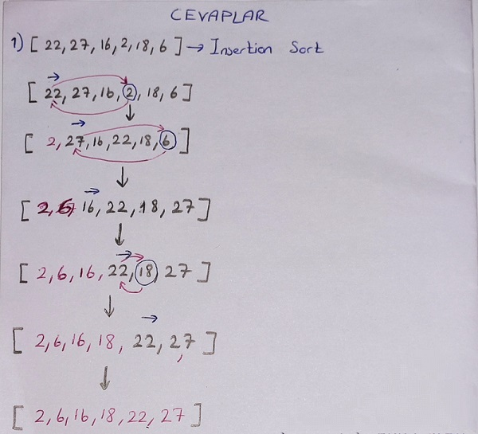
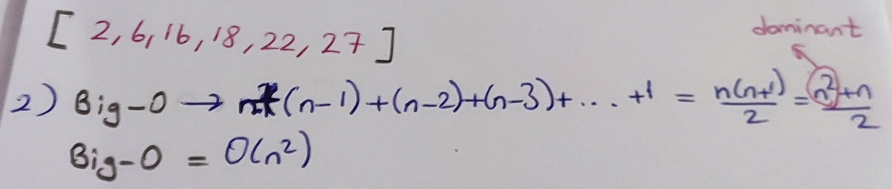
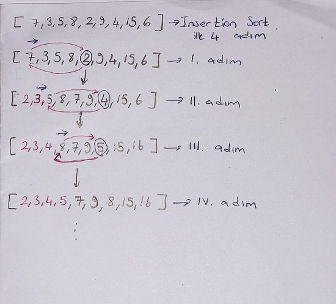

# Insertion Sort Projesi
## Sorular

**i)** [22,27,16,2,18,6] -> Insertion Sort
1. Yukarı verilen dizinin sort türüne göre aşamalarını yazınız.
2. Big-O gösterimini yazınız.
3. Time Complexity: Average case: Aradığımız sayının ortada olması,Worst case: Aradığımız sayının sonda olması, Best case: Aradığımız sayının dizinin en başında olması.
4. Dizi sıralandıktan sonra 18 sayısı hangi case kapsamına girer? Yazınız.

**ii)** [7,3,5,8,2,9,4,15,6] dizisinin Insertion Sort'a göre ilk 4 adımını yazınız. 

## Cevaplar

**i)**

1. 

2. 

3. Time Complexity

* Best Case:    [ **2**,6,16,18,22,27]

* Worst Case:   [27,22,18,16,6, **2**]

* Average Case: [6,16,22, **2**,18,27]

4. Dizi sıralandıktan sonra şu hale gelir: [2,6,16,18,22,27].

   Bu durumda 18 dizinin ortasında olduğu için **average case** olur

**ii)**

---

**Ödev linki:** [patika.dev veri yapıları ve algoritmalar](https://app.patika.dev/courses/veri-yapilari-ve-algoritmalar/insertion-sort-proje)

